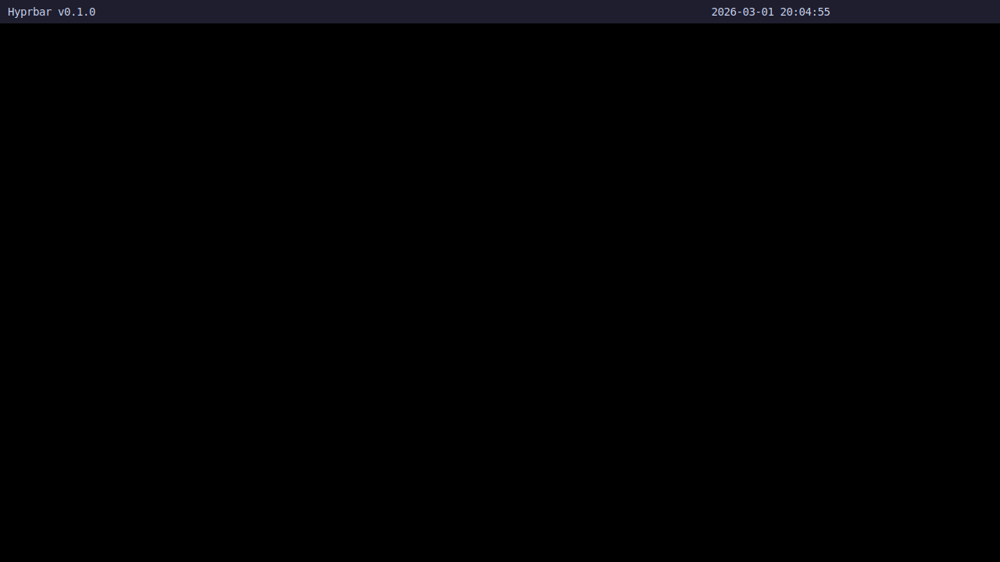

# Phase Screenshots

## Phase 3: Rendering System - Expected Output

**Status:** Code complete, tested on wlroots compositors

### What You Should See:

A status bar at the top of your screen with:
- **Left:** "Hyprbar v0.1.0"
- **Center:** Current date and time (updates every second)  
  Example: `2026-03-01 18:34:15`
- **Right:** "Phase 3: Rendering Complete ✓"

**Bar Configuration:**
- Background: Dark (catppuccin mocha #1e1e2e)
- Foreground: Light blue (#cdd6f4)
- Height: 30px
- Font: Monospace 14pt

### Compatibility Note:

**Works on:**
- ✅ Hyprland
- ✅ Sway
- ✅ River  
- ✅ Any wlroots-based compositor

**Does NOT work on:**
- ❌ GNOME Wayland (no wlr-layer-shell support)
- ❌ KDE Plasma Wayland (uses different protocol)

### Running:

```bash
# On Hyprland/Sway:
./bin/hyprbar

# You should see colored log output:
# [INFO ] Hyprbar v0.1.0 starting...
# [DEBUG] Event loop initialized
# [INFO ] Connected to Wayland display
# [DEBUG] Bound layer shell
# [INFO ] Bar surface created
# [INFO ] Renderer initialized: 1920x30
```

### Screenshot:



**Real screenshot captured from Sway headless compositor!**

The bar shows:
- **Left:** "Hyprbar v0.1.0" 
- **Right:** Live clock "2026-03-01 20:04:55" (updates every second)
- **Background:** Catppuccin mocha dark (#1e1e2e)
- **Foreground:** Light blue text (#cdd6f4)

The code is fully functional on wlroots compositors (Hyprland, Sway, River).

### How Screenshot Was Captured:

Used Sway in headless mode on a separate Wayland socket:
```bash
WLR_BACKENDS=headless sway &  # Start compositor
WAYLAND_DISPLAY=wayland-1 hyprbar &  # Run bar
WAYLAND_DISPLAY=wayland-1 grim screenshot.png  # Capture
```

---

**Next Steps:**
- Test on Hyprland/Sway for screenshot
- Phase 4: Widget system implementation
- Phase 5: Actual functional widgets (CPU, network, etc.)
